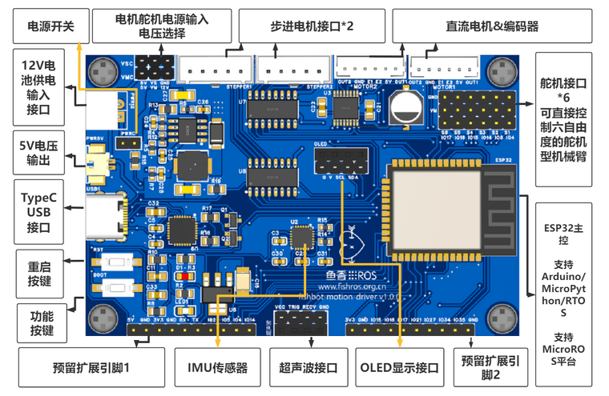

# How to build a new fireware
1. Use ubuntu Linux (Windows complained the path if microROS is too long)
2. Install vscode
3. Install vscode extension - platform.io
4. first time to build with vscode & platform.io (or run ./release.sh init)
5. after step 4, run release.sh to rebuild firmware
6. firmware file located at the path /bin
``` bash
cd fishbot_motion_control_microros
./release.sh
```

## Version File
``` C
# File: include/fishbot_config.h
#define VERSION_CODE "1.0.1p"
```

## FishBot Motion Control Board - MicroROS
[original source](https://github.com/fishros/fishbot_motion_control_microros)


## microros/micro-ros-agent on Host
``` bash
# Docker starts network proxy
docker run -it --rm -v /dev:/dev -v /dev/shm:/dev/shm --privileged --net=host microros/micro-ros-agent:$ROS_DISTRO udp4 --port 8888 -v4
# Docker starts serial port agent
docker run -it --rm -v /dev:/dev -v /dev/shm:/dev/shm --privileged --net=host microros/micro-ros-agent:humble serial --dev /dev/ttyUSB0 -b 921600 -v4

sudo tcpdump udp port 8888 -i eno1 -n
sudo tcpdump udp and net 192.168.16.0/24 -i eno1 -n

```
